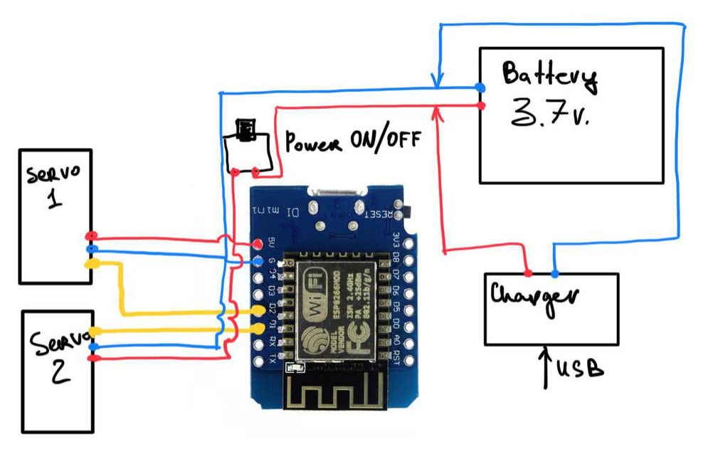

# ESP8266 RC Lego Snowcat

Это не готовый проект, а одна из последних прошивок для Лего вездехода на основе проекта https://github.com/lacour-vincent/wifi-car-esp8266.

Описание проекта: https://dev-and-ride.com/article/wi-fi-mashinki-lego

This is not a finished project, but one of the latest firmware for the Lego all-terrain vehicle based on the project "wifi-car-esp8266".

# Схема подключения

    

